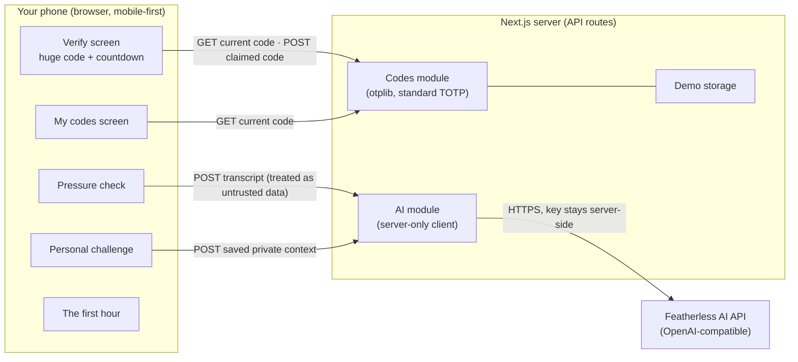

# Handshake

> **The voice can be cloned. The person can still prove who they are.**

Handshake is a mobile-first web app that helps you verify _who is actually on the
other end_ of a phone call or message — even when the voice sounds exactly like
someone you love. Instead of trying to detect the fake (an arms race that voice
detectors keep losing), Handshake checks something a clone can never have: access
to a secret your trusted circle shares.

Built solo for the **AI + Cybersecurity** track at
[ForgeHacks 2026](https://www.forgehacks.dev/) (Oct 3–10, 2026).

## The problem

> "Mom, it's me — I'm in trouble, I need money right now."

Modern voice cloning needs only seconds of audio — a voicemail, a social-media
post — to sound nearly indistinguishable from the real person. Even trained
listeners and commercial detectors struggle with good clones. And the victim is
usually alone, on the phone, under time pressure.

## Why this approach

Deepfake detection is an arms race: every detector is eventually outpaced by a
better generator. Handshake changes the question. We stop asking
_"is this voice real?"_ and ask _"does the person on this call have access to
something only the real person has?"_

The real person can always prove who they are in seconds — no matter how perfect
the fake is.

## Features (in build priority)

1. **Trusted Circle + rotating codes.** You and a trusted contact create a
   private pair. The pair shares a secret that produces a short code, changing
   every 30 seconds. During a call, the caller is asked to say the current code;
   you compare it with the huge code on your screen, or type what you heard for a
   server-confirmed verdict. A clone can't say a code it has never seen.
2. **Pressure check (AI).** Paste what the caller said (a transcript or message).
   An LLM flags manipulation tactics — artificial urgency, secrecy, immediate
   payment, authority pressure — and returns a risk level plus reasons, as
   validated structured data. Advisory, not a verdict.
3. **Personal challenge (AI).** From a few private details you saved in advance
   (nicknames, shared memories), the app generates a question only the real
   person could answer.
4. **The first hour.** A calm, static checklist for the 60 minutes after money
   has already moved. No AI, no decisions made under stress — just the right
   steps, in order.

## Architecture



All secrets — pair secrets and the AI key — live on the server only. The browser
never sees them. Full details in [ARCHITECTURE.md](./ARCHITECTURE.md); the threat
model and its honest limits in [SECURITY.md](./SECURITY.md).

## Stack

- **Next.js 16** (App Router) + **TypeScript** (strict) + **Tailwind CSS**
- **`otplib`** for the rotating codes (standard TOTP — no custom crypto)
- **`zod`** validates every API input and output, including LLM output
- **Featherless AI** (OpenAI-compatible API) for the two AI features; the key
  exists only in server environment variables
- **Demo-grade local storage** (see Honest limitations) · hosted on **Vercel**

## Quick start

```bash
git clone https://github.com/sudomarc/handshake
cd handshake
npm install
cp .env.example .env.local   # then fill in FEATHERLESS_API_KEY
npm run dev                  # http://localhost:3000
```

## Environment variables

Defined in [`.env.example`](./.env.example). Copy to `.env.local` (never
committed).

| Variable               | Required         | Purpose                                                                     |
| ---------------------- | ---------------- | --------------------------------------------------------------------------- |
| `FEATHERLESS_API_KEY`  | for AI features  | API key, server-side only                                                   |
| `FEATHERLESS_BASE_URL` | no (default set) | `https://api.featherless.ai/v1`                                             |
| `FEATHERLESS_MODEL`    | no (default set) | e.g. `Qwen/Qwen3.8-27B`                                                     |
| `PAIR_DERIVATION_KEY`  | for codes        | server secret used to derive pair secrets (lands with the codes module, J2) |

## The demo

Handshake is being built as a **working hackathon prototype**, not a simulated
click-through. The core verification flow is expected to work for real:

1. create a trusted pair;
2. open the receiver flow on one device;
3. open the caller code on another device;
4. receive the same rotating code on both devices;
5. enter the claimed code;
6. get a real **Verified** or **Not verified** result.

The AI features should also call the configured Featherless endpoint when they are
presented as working features. A screenshot, prerecorded clip, or visual mockup
may be used as a **fallback or presentation aid**, but it must never be described
as a live feature when it is not actually connected and working.

The voice-clone contrast is also evidence-driven: only claim a detector result
that was actually observed and recorded. If the detector does not produce the
expected result, change the demo story rather than scripting a fictional result.

Full step-by-step script, roles, preflight checks and fallbacks:
[DEMO_SCRIPT.md](./DEMO_SCRIPT.md).

## Product direction

Handshake is currently a mobile-first web prototype so the core flow can be
tested quickly and demonstrated reliably.

The intended product split is:

- **Handshake Personal** — a future mobile app for families and individuals,
  with a deliberately simple experience.
- **Handshake Business** — a future web platform for organizations, where
  desktop dashboards and administration are more appropriate.
- **Handshake Core** — shared server-side trust and verification capabilities.

For Personal, the long-term UX goal is **automation rather than a toolbox**:
users should not have to decide whether to run Pressure Check, Personal Question,
or another internal control. Handshake should determine which verification signals
are appropriate and present one clear result. The current prototype keeps these
controls explicit because that is simpler and safer to demonstrate while the
underlying orchestration is still being designed.

## Honest limitations
- **Demo-grade storage.** Pair data lives in simple server-side local storage.
  On the hosted demo it may reset (serverless file systems are ephemeral), which
  is why the demo creates a fresh pair right before the show. A production
  version would need a real database, real accounts/auth, and encrypted
  server-side secret storage — see ARCHITECTURE.md.
- **The AI features are advisory.** The pressure check and challenge are LLM
  outputs: helpful signals, not guarantees. We do not claim detection accuracy
  numbers because we have not measured them and would not report unprovable
  ones.
- **Shared-secret trust model.** The codes prove the caller can access a device
  enrolled in the circle. If that device is stolen, the codes go with it — the
  same trust model as any one-time-password system.
- **No accounts in the demo.** Anyone who knows a pair ID can interact with that
  pair; the pair ID is the shared secret, not a username.

## Ethics & consent

- The voice clone used in the demo is of the **developer's own voice**, with
  consent. No real third party is impersonated.
- "Mom" is a role-played scenario for the demo; no real person is targeted, and
  no real scam is attempted.
- Transcripts are analyzed in memory by the LLM provider and are not stored by
  the app. Before any production use, the provider's data-retention and
  no-training policies must be reviewed (not yet done for this demo).

## Documentation

- [ARCHITECTURE.md](./ARCHITECTURE.md) — components, data flows, trust boundaries
- [SECURITY.md](./SECURITY.md) — plain-language threat model, mitigations and gaps
- [ROADMAP.md](./ROADMAP.md) — day-by-day plan and cut list
- [DEMO_SCRIPT.md](./DEMO_SCRIPT.md) — the exact demo flow with fallbacks
