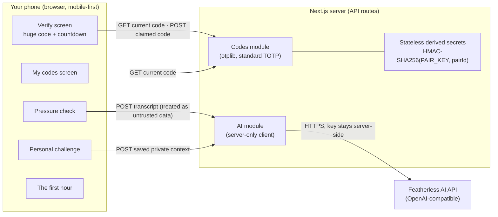

# Handshake

> **The voice can be cloned. The person can still prove who they are.**

Handshake is a mobile-first web app that helps you verify _who is actually on the
other end_ of a phone call or message — even when the voice sounds exactly like
someone you love. Instead of trying to detect the fake (an arms race that voice
detectors keep losing), Handshake checks something a clone can never have: access
to a secret your trusted circle shares.

Built solo for the **AI + Cybersecurity** track at
[ForgeHacks 2026](https://www.forgehacks.dev/) (Oct 3–10, 2026).

## The problem

> "Mom, it's me — I'm in trouble, I need money right now."

Modern voice cloning needs only seconds of audio — a voicemail, a social-media
post — to sound nearly indistinguishable from the real person. Even trained
listeners and commercial detectors struggle with good clones. And the victim is
usually alone, on the phone, under time pressure.

## Why this approach

Deepfake detection is an arms race: every detector is eventually outpaced by a
better generator. Handshake changes the question. We stop asking
_"is this voice real?"_ and ask _"does the person on this call have access to
something only the real person has?"_

The real person can always prove who they are in seconds — no matter how perfect
the fake is.

## Features (in build priority)

1. **Trusted Circle + rotating codes.** You and a trusted contact create a
   private pair. The pair shares a secret that produces a short code, changing
   every 30 seconds. During a call, the caller is asked to say the current code;
   you compare it with the huge code on your screen, or type what you heard for a
   server-confirmed verdict. A clone can't say a code it has never seen.
2. **Pressure check (AI).** Paste what the caller said (a transcript or message).
   An LLM flags manipulation tactics — artificial urgency, secrecy, immediate
   payment, authority pressure — and returns a risk level plus reasons, as
   validated structured data. Advisory, not a verdict.
3. **Personal challenge (AI).** From a few private details you saved in advance
   (nicknames, shared memories), the app generates a question only the real
   person could answer.
4. **The first hour.** A calm, static checklist for the 60 minutes after money
   has already moved. No AI, no decisions made under stress — just the right
   steps, in order.

## Architecture



All secrets — pair secrets and the AI key — live on the server only. The browser
never sees them. Full details in [ARCHITECTURE.md](./ARCHITECTURE.md); the threat
model and its honest limits in [SECURITY.md](./SECURITY.md).

## Stack

- **Next.js 16** (App Router) + **TypeScript** (strict) + **Tailwind CSS**
- **`otplib`** for the rotating codes (standard TOTP — no custom crypto)
- **`zod`** validates every API input and output, including LLM output
- **Featherless AI** (OpenAI-compatible API) for the two AI features; the key
  exists only in server environment variables
- **Stateless HMAC derivation** for TOTP pair secrets (see ARCHITECTURE.md) · hosted on **Vercel**

## Quick start

```bash
git clone https://github.com/sudomarc/handshake
cd handshake
npm install
cp .env.example .env.local   # then fill in FEATHERLESS_API_KEY
npm run dev                  # http://localhost:3000
```

## Environment variables

Defined in [`.env.example`](./.env.example). Copy to `.env.local` (never
committed).

| Variable               | Required         | Purpose                                                                     |
| ---------------------- | ---------------- | --------------------------------------------------------------------------- |
| `FEATHERLESS_API_KEY`  | for AI features  | API key, server-side only                                                   |
| `FEATHERLESS_BASE_URL` | no (default set) | `https://api.featherless.ai/v1`                                             |
| `FEATHERLESS_MODEL`    | no (default set) | e.g. `Qwen/Qwen3.8-27B`                                                     |
| `PAIR_DERIVATION_KEY`  | for codes        | server secret used to derive pair secrets (lands with the codes module, J2) |

## The demo

Handshake is being built as a **working hackathon prototype**, not a simulated
click-through. The core verification flow is expected to work for real:

1. create a trusted pair;
2. open the receiver flow on one device;
3. open the caller code on another device;
4. receive the same rotating code on both devices;
5. enter the claimed code;
6. get a real **Verified** or **Not verified** result.

The AI features should also call the configured Featherless endpoint when they are
presented as working features. A screenshot, prerecorded clip, or visual mockup
may be used as a **fallback or presentation aid**, but it must never be described
as a live feature when it is not actually connected and working.

The voice-clone contrast is also evidence-driven: only claim a detector result
that was actually observed and recorded. If the detector does not produce the
expected result, change the demo story rather than scripting a fictional result.

Full step-by-step script, roles, preflight checks and fallbacks:
[DEMO_SCRIPT.md](./DEMO_SCRIPT.md).

## Product direction

Handshake is currently a working Next.js web prototype plus a **Handshake
Personal** mobile client. The hackathon deliverable is the Personal mobile
product for families and individuals; the existing web app is preserved as the
working web prototype/API client and reference implementation.

The intended product split is:

- **Handshake Personal** — mobile protection for individuals and trusted circles.
- **Handshake Business** — the post-hackathon web product for organizations.
- **Handshake Core** — shared server-side trust and verification capabilities.

### Personal UX direction

The long-term Personal experience is **automation rather than a toolbox**.

When there is no call, Handshake should be a calm trust center showing protection
status, trusted people, recent activity and privacy/settings controls.

When a supported call or communication session begins, Handshake should enter a
**Call Protection Mode** that feels like **Android + Handshake**, not a second
phone application. The intended user-facing states are **Protected**, **Verify**
and **Risk**.

Pressure Check, Personal Challenge and rotating-code verification should become
internal capabilities selected by Handshake rather than tools the user must
manually open one by one.

### Real-time call analysis direction

For a call type where the platform legitimately exposes an analyzable audio stream,
the intended pipeline is:

**audio → voice-activity detection → short rolling buffer → speech-to-text →
incremental risk analysis → risk engine → Protected / Verify / Risk → contextual
action.**

The LLM should analyze transcript chunks and derived context, not receive the raw
audio stream continuously. Target latency is roughly 1–2 seconds for a meaningful
risk update, but this is a future design target, not a measured performance claim.
Pressure analysis remains advisory: it is not a voice-clone detector and cannot
prove that a caller is genuine or fake.

### Android platform boundary

Android's CallScreeningService can support call screening/caller-ID integration,
while deeper in-call or controlled VoIP architectures may be needed when an app
must own the audio streams. A microphone foreground service can continue microphone
capture under Android's permission and background-execution rules, but
RECORD_AUDIO alone does not establish access to both sides of a carrier call.

The first technical step after the hackathon is a **native Android audio-feasibility
prototype** on the target Samsung A17. It should test incoming/outgoing carrier
calls, microphone, remote-audio availability, speakerphone, earpiece, Bluetooth,
foreground/background execution and the stream actually exposed to the chosen
native audio API.

Until this feasibility gate is passed, Handshake must not claim automatic
interception of every phone call, two-way carrier-call audio access, live
real-time phone-call analysis, cloned-voice detection or invisible background
listening.

See [ROADMAP.md](./ROADMAP.md) for the complete call-protection UX,
real-time-analysis pipeline, Android integration layers and phased plan.
## Honest limitations
- **Stateless pair secrets.** Pair secrets are derived on demand using
  `HMAC-SHA256(PAIR_DERIVATION_KEY, pairId)`. There is no pair database or
  server-side state to lose across serverless redeploys. Anyone with the pair ID
  can generate and verify codes. A production version would require real
  accounts/auth, device registration, and encrypted secret storage — see
  ARCHITECTURE.md and SECURITY.md.
- **The AI features are advisory.** The pressure check and challenge are LLM
  outputs: helpful signals, not guarantees. We do not claim detection accuracy
  numbers because we have not measured them and would not report unprovable
  ones.
- **Shared-secret trust model.** The codes prove the caller can access a device
  enrolled in the circle. If that device is stolen, the codes go with it — the
  same trust model as any one-time-password system.
- **No accounts in the demo.** Anyone who knows a pair ID can interact with that
  pair; the pair ID is the shared secret, not a username.

## Ethics & consent

- The voice clone used in the demo is of the **developer's own voice**, with
  consent. No real third party is impersonated.
- "Mom" is a role-played scenario for the demo; no real person is targeted, and
  no real scam is attempted.
- Transcripts are analyzed in memory by the LLM provider and are not stored by
  the app. Before any production use, the provider's data-retention and
  no-training policies must be reviewed (not yet done for this demo).

## Hackathon submission standard

ForgeHacks requires a **working AI-powered project** addressing a real-world
problem. The submission must include a project description, track selection, a
**public 2–4 minute demo video** showing the problem and how the project works,
a GitHub repository with source code and a clear README, a written description
covering the problem/target users, technical approach and real-world impact, and
supporting evidence such as screenshots, an architecture diagram, or a testing
deployment link.

The judging criteria explicitly include **Execution & Completeness**, which
looks at working demo, polish, usability, and how much was actually shipped.
Incomplete submissions missing the required video or code are not eligible for
judging.

Source: https://forgehacks-2026.devpost.com/ and
https://forgehacks-2026.devpost.com/rules

For Handshake, this means:

- the core verification flow must work for real;
- any AI feature presented as live must actually call the configured backend;
- screenshots/prerecorded footage are acceptable as clearly identified fallbacks
  or presentation aids, not as substitutes for a claimed live feature;
- external results such as a deepfake-detector classification must be observed
  before they are claimed;
- future mobile, Business, production, and other unshipped features should be
  labeled as future direction rather than represented as completed functionality.

## Documentation

- [ARCHITECTURE.md](./ARCHITECTURE.md) — components, data flows, trust boundaries
- [SECURITY.md](./SECURITY.md) — plain-language threat model, mitigations and gaps
- [ROADMAP.md](./ROADMAP.md) — day-by-day plan, demo standard, and product direction
- [DEMO_SCRIPT.md](./DEMO_SCRIPT.md) — exact demo flow with evidence-based fallbacks
- [HACKATHON.md](./HACKATHON.md) — verified ForgeHacks submission requirements
